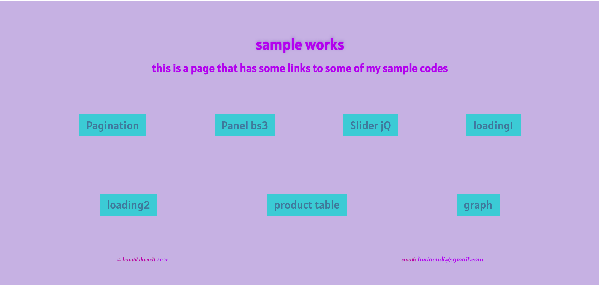

# **Sample-works1**
The sample codes that I had until _march 2021_

## Last update 
2021-04-12
## Online Link
You can visit the online sample works from the link below:

> [online sample works1](https://sample-works1.herokuapp.com)
## Description
This is the codes of some of my sample works, just for exercise. The codes contain 7 simple projects that are explained below:
### Graphs
> In this work I used data from a **json** file to send them to UI and showing them as a percentage for the product. Although this have _only_ one product but the goal was to use json data and animate them in a graph.
#### Used Technologies
* jQuery
* javascript
* json
* Bootstrap4
* Ajax
### Slider jQ
> The slider here is made with **fade methods** of jQuery library. The good point about this slider is that at first the page is loading _without_ any image and during the slider running **only two** images are present in HTML file. If the slider is not running smoothly, refresh the page.
#### Used Technologies
* jQuery
* javascript
### Loading 1 and 2
> These two loading effects made with only using CSS animation. They are useful as **preloaded animations** before the web pages’ load process become complete. 
#### Used Technologies
* HTML
* CSS
### Product Table
> The table shows some product with their prices. The important point about the table is customizing the _input field_ for entering the number of products. The input has been built in such a way that the user could do that with **+** and **–** icons and also directly write the number of products. The table does not accept the _negative_ values and the total price is calculated **immediately** after changing values.
#### Used Technologies
* Bootstrap4
* javascript
* jQuery
* CSS
### Panel
> The panel designed with custom CSS codes. The goal of this work was to build panel with **bootstrap3 panel component** and then customizing that to change the default styles.
#### Used Technologies
* Bootstrap3
* CSS
* HTML
### Pagination 
> This Pagination was built with _Bootstrap cards_ and the data are loaded via **Ajax and json** file. The animations and effects of cards are made with _jQuery_. Also I used jQuery **simplePagination** plugin for functionality of the pagination. 
#### Used Technologies
* jQuery
* Ajax
* json
* Bootstrap4
## Author
These sample works are created by **Hamid Davodi**.
 > You can send messages to me from my email address: 

**hadavudi4@gmail.com**

